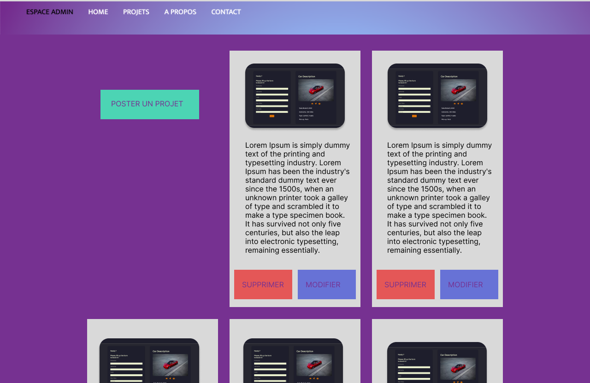

# Checkpoint 4 - Portfolio

Création d'une base de donnée, d'un back-end  et d'une section admin en front-end pour mon  [portfolio](https://lana-duval.netlify.app/) en ligne. 
La charte graphique  a été reprise de ce premier projet. 
Vous pouvez retrouver les maquettes réalisées sur #figma à la fin de ce README.

## API 
APOD (nasa)

## Technos
React js /
Express, Node js / MYSQL 

## MCD 
  

## Maquettes
  
  
 
 
 

## Screens Desktop
 

## Setup & Use

### Project Initialization

- In VSCode, install plugins **Prettier - Code formatter** and **ESLint** and configure them
- Clone this repo, enter it
- Run command `npm run setup`
- _NB: To launch the backend server, you'll need an environment file with database credentials. You'll find a template one in `backend/.env.sample`_

### Available Commands

- `setup` : Initialization of frontend and backend, as well as all toolings
- `migrate` : Run the database migration script
- `dev` : Starts both servers (frontend + backend) in one terminal
- `dev-front` : Starts the React frontend server
- `dev-back` : Starts the Express backend server
- `lint` : Runs validation tools, and refuses unclean code (will be executed on every _commit_)
- `fix` : Fixes linter errors (run it if `lint` growls on your code !)

## FAQ

### Tools

- _Concurrently_ : Allows for several commands to run concurrently in the same CLI
- _Husky_ : Allows to execute specific commands that trigger on _git_ events
- _Vite_ : Alternative to _Create-React-App_, packaging less tools for a more fluid experience
- _ESLint_ : "Quality of code" tool, ensures chosen rules will be enforced
- _Prettier_ : "Quality of code" tool as well, focuses on the styleguide
- _ Airbnb Standard_ : One of the most known "standards", even though it's not officially linked to ES/JS
- _Nodemon_ : Allows to restart the server everytime a .js file is udated
